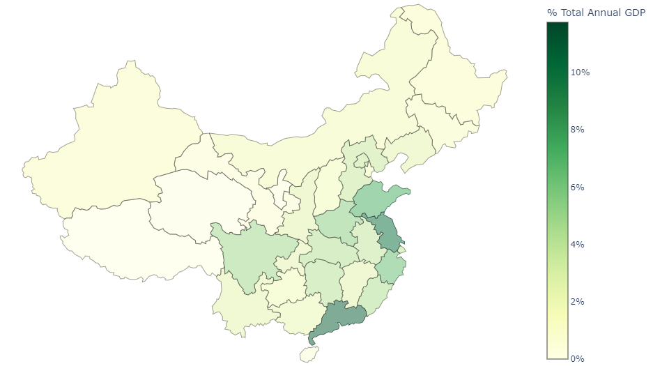

# China GDP: Data Analysis

    

In this project, I analyse annual GDPs of China's provincial-level regions, from 1992-2020 inclusive. 

## Description

    

Yes. 

Because, in 2020, China was ranked 2nd in the world by norminal GDP ([IMF 2021](https://www.imf.org/en/Publications/WEO/weo-database/2021/October/weo-report?c=512,914,612,171,614,311,213,911,314,193,122,912,313,419,513,316,913,124,339,638,514,218,963,616,223,516,918,748,618,624,522,622,156,626,628,228,924,233,632,636,634,238,662,960,423,935,128,611,321,243,248,469,253,642,643,939,734,644,819,172,132,646,648,915,134,652,174,328,258,656,654,336,263,268,532,944,176,534,536,429,433,178,436,136,343,158,439,916,664,826,542,967,443,917,544,941,446,666,668,672,946,137,546,674,676,548,556,678,181,867,682,684,273,868,921,948,943,686,688,518,728,836,558,138,196,278,692,694,962,142,449,564,565,283,853,288,293,566,964,182,359,453,968,922,714,862,135,716,456,722,942,718,724,576,936,961,813,726,199,733,184,524,361,362,364,732,366,144,146,463,528,923,738,578,537,742,866,369,744,186,925,869,746,926,466,112,111,298,927,846,299,582,487,474,754,698,&s=NGDPD,PPPGDP,&sy=2020&ey=2021&ssm=0&scsm=0&scc=0&ssd=1&ssc=0&sic=0&sort=country&ds=.&br=1)), and, a year later, overtook USA as the wealthiest nation in the world ([Yahoo Finance 2021](https://finance.yahoo.com/news/report-china-now-worlds-richest-170102566.html?guccounter=1&guce_referrer=aHR0cHM6Ly9lbi53aWtpcGVkaWEub3JnLw&guce_referrer_sig=AQAAAFJGFXnSvLPnX9OtJ9eFiy3Wz1dqzpJ1vRojl8DLBeUsInvpccLX8LYiuPxFr0VGj8MQw57GUTELDRx_ShPSd6ZzN-VEE7nU6Gmuk3C2_cCWRHdnVpa-dSikrUERqfw9QQVvQBoM0ahNF26is6x3gxTI8XKIrrLOtymqVJMqWTvO)). This drew my interest into analysing its annual GDP from the early '90s at the provincial level to uncover insights.

## Features & Insights
In this project, I highlights patterns and trends in China's provincial-level GDPs in the `china_province_gdp.ipynb` notebook.

Although trending upwards, different regions grew at different rates. ***Guangdong*, *Jiangsu*, and *Shandong* experienced immense growth, consistently contributing a high proportion of China's total, annual GDP.** Contrastingly, ***Tibet*, *Ningxia* and *Qinghai* experienced low growth, and continue to lag in GDP.** These growth differences have led to increasingly greater gaps in GDP.

The choropleth maps (below) implied that regions' GDPs may differ due to geographical location. 

    

From this, I wished to examine China's 'Statistical Regions', which are geographical groupings of provincial-level regions. In the `additional_data.ipynb` Notebook, I scraped and exported this dataset, helping to discover that ***East China* has the highest GDP**, whereas ***Northwest China* continuously experience low GDP**. 

## How To Use
To refresh the data, please:
1. Fork this repository,
2. Update the input .csv from **[Kaggle](https://www.kaggle.com/datasets/concyclics/chinas-gdp-in-province?select=Chinas+GDP+in+Province+En.csv)**, and
3. Re-run the relevant parts of the `additional_data.ipynb` Notebook to load, clean, and export .csv(s) from Wikipedia.

## Frameworks
This project is driven by Python in Jupyter Notebooks. The libraries I primarily use are:

| Library      | Use                                    |
| ------------ | -------------------------------------- |
| `pandas`     | Loading, cleaning, and displaying data |
| `matplotlib` | Data visualisation                     |
| `seaborn`    | Data visualisation                     |
| `plotly`     | Data visualisation - choropleth maps   |
| `wikipedia`  | Loading data from Wikipedia            |
| `json`       | Loading data for choropleth maps       |

## References & Resources
The base data is from **[Kaggle](https://www.kaggle.com/datasets/concyclics/chinas-gdp-in-province?select=Chinas+GDP+in+Province+En.csv)**, with additional data extracted from **[Wikipedia](https://en.wikipedia.org/wiki/Main_Page)**.

To assist with building my choropleth maps, I relied on the following resources:
* yg2619, 'Choropleth-Maps-in-Python-Using-Plotly', <[GitHub Repository](https://github.com/yg2619/Choropleth-Maps-in-Python-Using-Plotly)>
* deldersveld, 'topojson', <[GitHub Repository](https://github.com/deldersveld/topojson)>
* Ying Li, 'A beginners Guide to Choropleth Map In Python to Visualize China's Aging Problem', <[LinkedIn](https://www.linkedin.com/pulse/beginners-guide-choropleth-map-python-visualize-chinas-ying-li/)>

**Please note that the data does not include Hong Kong SAR nor Macau SAR.**